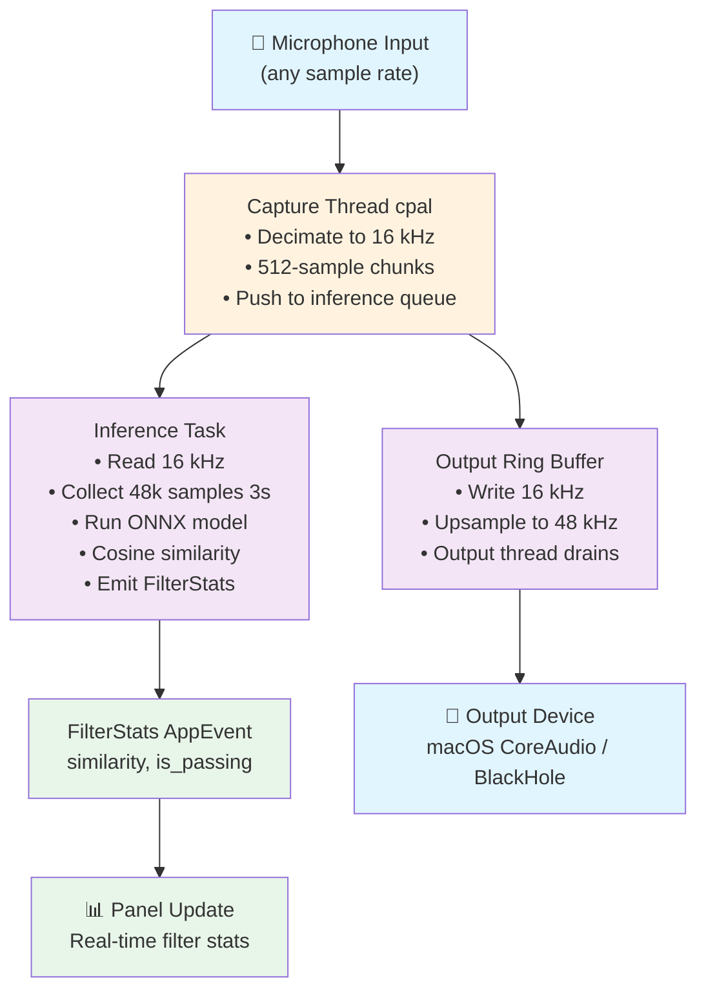
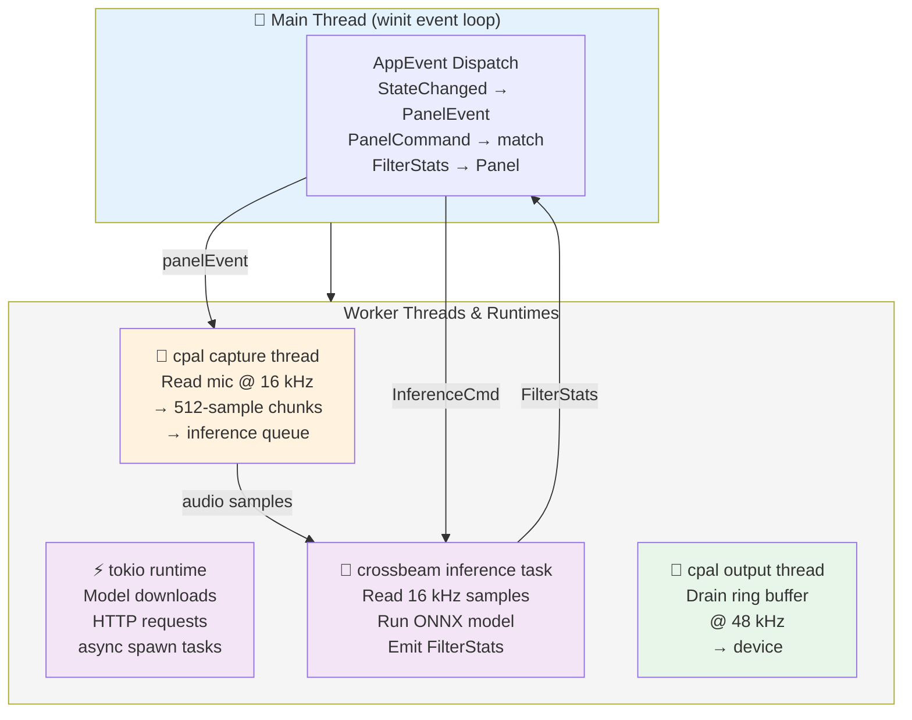
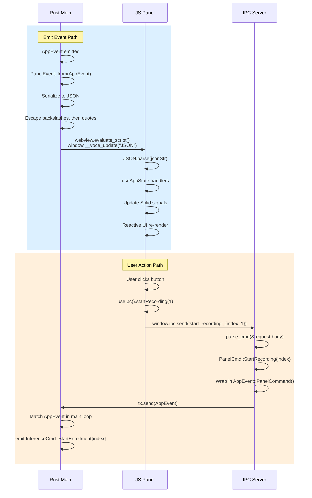
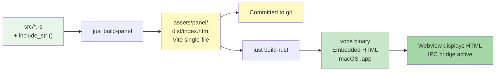
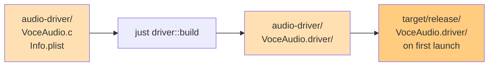
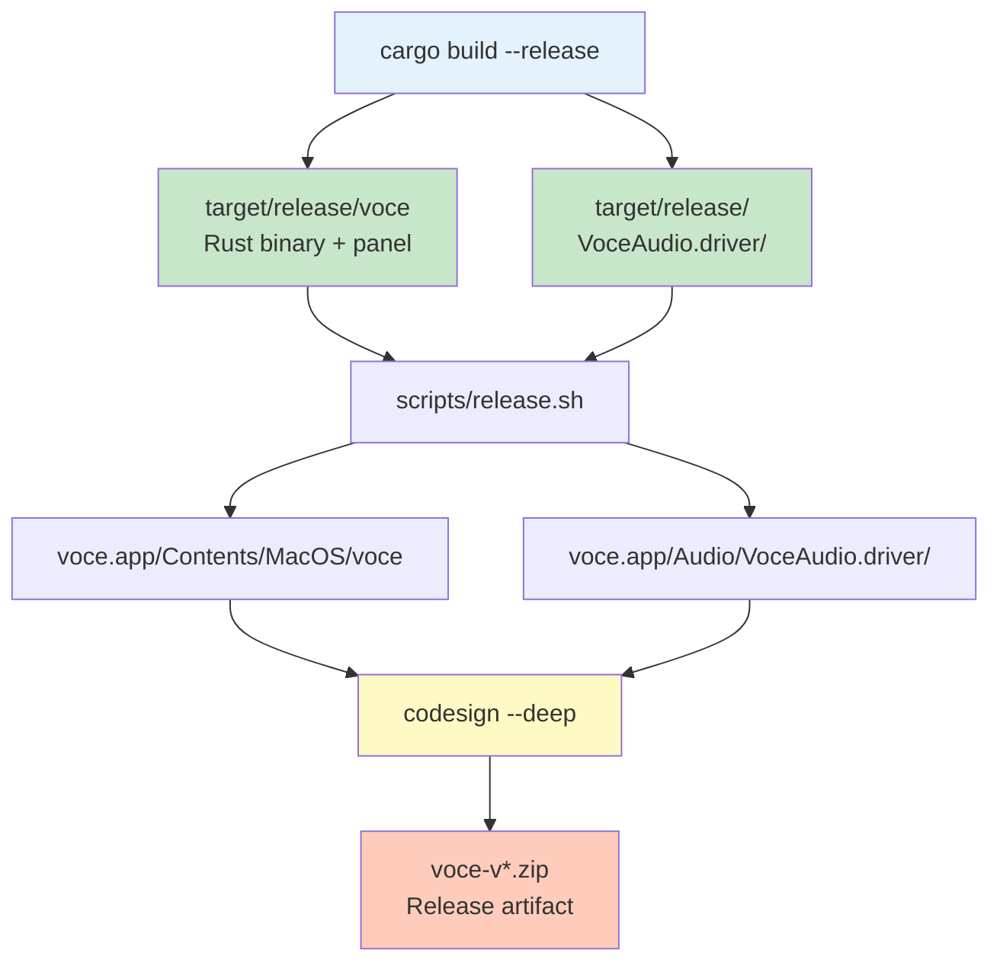
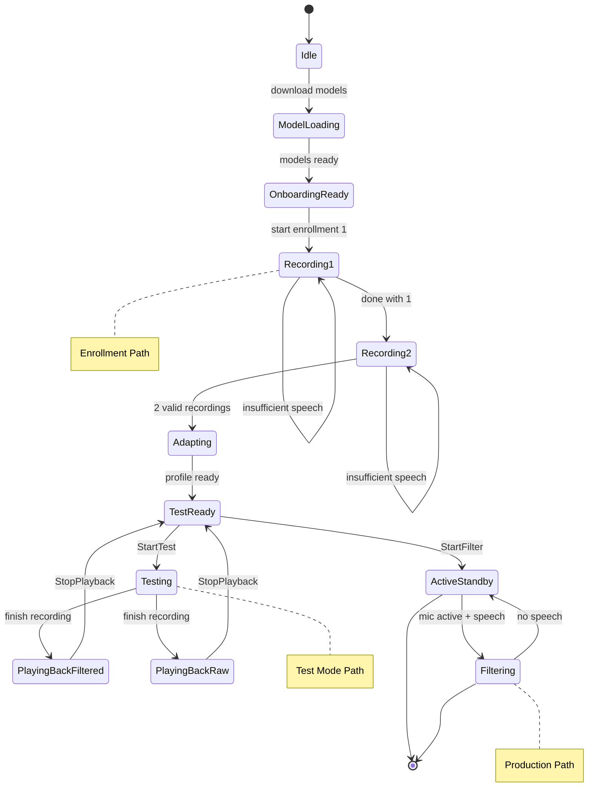

# Voce Architecture Overview

This document is a **cross-cutting reference** for agents making changes that span multiple areas. For area-specific detail, see:

- **`src/AGENTS.md`** — Rust backend module map, state machine, concurrency model
- **`src/panel/AGENTS.md`** — IPC contract (PanelCmd, PanelEvent, escaping rules)
- **`assets/panel/AGENTS.md`** — Frontend tech stack, screens, hooks, components
- **`eval/AGENTS.md`** — Evaluation harness, datasets, benchmarks
- **Root `AGENTS.md`** — Project overview, tooling, task management

---

## Data Flow: Microphone → Output

The signal path through Voce:



**Key rates:**
- **Input capture**: 16 kHz (decimated from device rate)
- **Processing chunks**: 512 samples = 32 ms (tick rate)
- **ONNX window**: 48 000 samples = 3 s @ 16 kHz
- **Output ring buffer**: 48 kHz nominal (for upsampling to macOS/BlackHole)

---

## Thread & Runtime Model

Voce uses a hybrid model:



### Synchronization

- **Main → Inference**: `crossbeam::channel::Sender<InferenceCmd>` (blocking send)
- **Inference → Main**: `AppEvent` enum pushed to event loop (non-blocking)
- **Capture ↔ Inference**: Audio samples via crossbeam queue; samples enqueued as chunks arrive
- **Inference ↔ Output**: Ring buffer (circular buffer shared by two threads, no mutex)

### AtomicBool Gate

A shared `AtomicBool` controls immediate filter muting:

```rust
let gate = Arc::new(AtomicBool::new(false));
let gate_clone = gate.clone();

// Inference task
while gate_clone.load(Ordering::Relaxed) {
    // Read from audio queue, process, write to ring buffer
}

// Main thread (on PanelCmd::ToggleFilter)
gate.store(!gate.load(...), Ordering::Relaxed);
```

This allows sub-32ms muting without stopping the task or ring buffer drain.

---

## IPC Bridge (Rust ↔ JavaScript)

Two-way message passing via webview:



See `src/panel/AGENTS.md` for PanelCmd/PanelEvent tables and escaping rules.

---

## Build Pipeline

### Rust → Binary



Steps:
1. `just build-panel` → `assets/panel/dist/index.html` (Vite single-file output)
2. `just build-rust` → Compiles Rust, embeds HTML via `include_str!()`
3. HTML is **committed to git** (dist/index.html in repo)

### Audio Driver → Bundle



### Release Bundle



---

## Runtime Data Files

User configuration and models live in `~/.voce/`:

```
~/.voce/
├── config.json                 # User threshold + vote window
│                               # {"threshold": 0.75, "vote_window": 3}
├── enrolled_embedding.json     # Speaker embedding (if enrolled)
│                               # {"embedding": [f32, ..., f32]} (256 floats)
└── models/
    ├── wespeaker-...onnx       # Speaker embedding model (downloaded)
    ├── vad-...onnx             # Voice activity detector (downloaded)
    └── ...
```

Models are downloaded on first run and cached. Embeddings are extracted and saved post-enrollment.

---

## Key Rate Boundaries & Reasoning

| Boundary | Value | Used For | Reasoning |
|----------|-------|----------|-----------|
| **Mic input** | Any | Capture | Device-dependent; decimated to 16 kHz |
| **Capture output** | 16 kHz | Processing, inference | ONNX model trained on 16 kHz speech |
| **Processing chunk** | 512 samples (32 ms) | Tick rate, state checks | Balance: low latency vs. processing overhead |
| **ONNX window** | 48 000 samples (3 s) @ 16 kHz | Embedding extraction | Model trained on 3 s windows; higher context for speaker identification |
| **Ring buffer nominal** | 48 kHz | Output device | Standard macOS/CoreAudio rate; upsamples 16 kHz filtered audio |
| **Output chunk** | Varies (cpal-dependent) | macOS I/O | CoreAudio callback size; 512–4096 samples typical |

**Why 48 kHz output when input is 16 kHz?**

The ring buffer uses 48 kHz as a nominal rate because:
1. macOS CoreAudio primarily works at 48 kHz (or 44.1 kHz on some devices)
2. BlackHole (virtual mic) expects 48 kHz
3. The filtered 16 kHz audio is resampled to 48 kHz before output to avoid aliasing artifacts
4. The 16 kHz inference pipeline is decoupled from the output sample rate via the ring buffer

---

## State Machine (Quick Reference)

For detailed state machine diagram, see `src/AGENTS.md`.



---

## Contact Surface Checklist

When making changes, check each area's invariants:

- **Audio rates** (16 kHz, 48 kHz)? → Update `src/audio/`, docs, eval
- **State transitions**? → Update `src/app_state.rs`, panel screens
- **New IPC message**? → Sync `src/panel/ipc.rs`, JS hooks, UI components
- **New eval dataset**? → Add to `eval/scripts/`, update `eval/justfile`, sync `eval/AGENTS.md`
- **Frontend component** → Add screen type, routing, signals, styles
- **Audio driver** → Test with `just driver::build`, verify install

See individual AGENTS.md files for step-by-step checklists.
