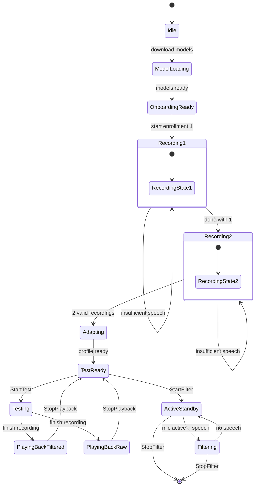

# src/ — Rust Backend Architecture

The Rust backend runs on the main thread (winit event loop) and coordinates audio capture, ONNX inference, IPC with the panel, and filter state. It does not use async/await for the main app loop; I/O and compute are delegated to tokio, cpal, and crossbeam.

---

## Module Map

| Module | Purpose | Key Files |
|--------|---------|-----------|
| `main.rs` | Entry point, winit loop, app event dispatch | `main.rs` |
| `app_state.rs` | Application state machine (11 states) | `app_state.rs` |
| `events.rs` | Cross-thread event enums (`AppEvent`, `InferenceCmd`) | `events.rs` |
| `audio/` | Mic capture, ring buffer, output mixing | `capture.rs`, `output.rs`, `buffer.rs`, `denoise.rs` |
| `config.rs` | Load/save `~/.voce/config.json` | `config.rs` |
| `filter/` | Cosine-similarity gate and vote window | `gate.rs` |
| `enrollment/` | UI flow for recording, embedding averaging | `recorder.rs`, `profile.rs`, `mod.rs` |
| `inference.rs` | Inference task: reads samples, runs ONNX, emits filter stats | `inference.rs` |
| `model/` | ONNX model management (download, embedder, VAD, WeSpeaker) | `embedder.rs`, `wespeaker.rs`, `vad.rs`, `download.rs` |
| `panel/` | IPC server and command marshalling | `ipc.rs`, `mod.rs` |
| `eval.rs` | Eval mode (`--eval`, `--eval-enroll` flags) | `eval.rs` |
| `driver.rs` | Copy `VoceAudio.driver` to `target/release/` on build | `driver.rs` |

---

## AppEvent Enum (from `events.rs`)

All cross-thread messages funnel through the winit main event loop:

| Variant | Payload | Source | Purpose |
|---------|---------|--------|---------|
| `TrayIcon(event)` | tray-icon event | cpal/macOS | Menu interactions (show/hide panel) |
| `Menu(event)` | muda menu event | menu click | Standard menu items |
| `StateChanged(state)` | `AppState` | inference task / UI | State transition (e.g., `ModelLoading → OnboardingReady`) |
| `RecordingProgress` | `index`, `elapsed_s`, `speech_s` | encoder task | Live progress during enrollment |
| `RecordingComplete` | `index`, `speech_s` | encoder task | Enrollment recording done |
| `RecordingInvalid` | `index` | encoder task | Insufficient speech detected |
| `ModelReady` | — | model download task | ONNX models fetched & loaded |
| `FilterStats` | `similarity: f32`, `passing: bool` | inference task | Real-time filter decision |
| `BlackHoleStatus` | `found: bool` | audio init | Virtual mic availability check |
| `DownloadProgress` | `fraction: f32` | model download task | Model download % (0.0–1.0) |
| `PanelCommand(cmd)` | `PanelCmd` (from `src/panel/ipc.rs`) | panel JS | Command from the UI |
| `OpenPanel` | — | tray icon | Show panel window |
| `EnrolledProfileReady` | `[f32; 256]` embedding | inference task | Enrollment complete, profile saved |
| `TestProgress` | `elapsed_s` | inference task | Live test recording progress |
| `TestCaptureComplete` | filtered/raw samples, voice % | inference task | Test recording done |
| `ReplayTest` | — | panel / menu | Play back filtered test recording |
| `ReplayTestRaw` | — | panel / menu | Play back unfiltered test recording |
| `StopPlayback` | — | inference / panel | Stop any playback |
| `FilterPaused` | `paused: bool` | inference task | Filter toggle state (→ panel) |

---

## InferenceCmd Enum (from `events.rs`)

Commands sent from the main thread → inference task via crossbeam channel:

| Variant | Payload | Context | Effect |
|---------|---------|---------|--------|
| `StartEnrollment` | `index: u8` (1 or 2) | Panel: "Record sample 1/2" | Begin capture + embedding extraction |
| `StartFilter` | `[f32; 256]` embedding | Panel: "Confirm enrollment" | Transition to filtering + output ring buffer |
| `StopFilter` | — | Panel: "Pause filter" | Stop reading from ring buffer |
| `StartTest` | — | Panel: "Test filter" | Begin filtered capture (compare with raw) |
| `StopTest` | — | Panel or UI | Stop test recording |

---

## AppState Machine

The state machine defines valid transitions and what happens in each state:

**Key transitions:**
- `OnboardingReady` → `Recording{1}` → `Recording{2}` → `Adapting` → `TestReady` (enrollment path)
- `TestReady` ↔ `Testing` ↔ `PlayingBack*` (test mode)
- `TestReady` → `ActiveStandby` ↔ `Filtering` (production filter)

---

## Concurrency Model

The app uses **no async/await** on the main thread; I/O and compute are delegated:

| Thread / Runtime | Role | Management |
|------------------|------|------------|
| **winit main** | Event loop, state transitions, UI updates | Single-threaded, event-driven |
| **tokio runtime** | Model downloads, HTTP requests | Spawned once, `tokio::spawn()` tasks |
| **cpal capture** | Microphone stream (separate thread) | `cpal::Stream` backend-specific |
| **cpal output** | Ring buffer drain (separate thread) | `cpal::Stream` backend-specific |
| **inference task** | ONNX inference, filter decision | Spawned via crossbeam, signaled by `InferenceCmd` |
| **encoder task** | WAV recording during enrollment / test | crossbeam channel for samples, file I/O |

### Cross-Thread Sync

- `AppEvent` → `main.rs` via custom event loop (winit-compatible)
- `InferenceCmd` → inference task via crossbeam `Sender<InferenceCmd>`
- Audio samples → inference task via crossbeam queue
- Filter stats → `AppEvent::FilterStats` → main → panel

### AtomicBool Gate

A shared `AtomicBool` guards the inference task's read loop:
- Set to `false` when `StopFilter` is issued
- Set to `true` when `StartFilter` is issued
- Allows immediate muting without stopping the task

---

## IPC Pattern Summary

Panel ↔ Rust communication uses a two-way bridge:

### Rust → JS (Event Stream)

`AppEvent` → `PanelEvent` → `evaluate_script()` → JS signals

1. Main thread emits `AppEvent::StateChanged(state)` or `FilterStats { ... }`
2. `panel/ipc.rs` converts to `PanelEvent` enum
3. `to_js_call()` escapes and wraps as JavaScript function call
4. Sends via `webview.evaluate_script()` (e.g., `window.__voce_update("STATE_CHANGED", {...})`)
5. JS `useAppState.ts` listens on `window.__voce_update` and updates signals

### JS → Rust (Command Dispatch)

`postMessage()` → `PanelCmd` → `AppEvent::PanelCommand` → main loop dispatch

1. Panel JS calls `window.ipc.send('ENROLL_START', {index: 1})`
2. Rust IPC server receives `{"cmd": "ENROLL_START", "index": 1}`
3. `panel/ipc.rs` parses → `PanelCmd::EnrollStart{index}`
4. Wrapped in `AppEvent::PanelCommand()` → main loop
5. Main loop matches and calls `StartEnrollment{index}` or `StartFilter{...}`

**Key invariant:** `PanelCmd`/`PanelEvent` enum changes must sync both directions (see `src/panel/AGENTS.md` for checklist).

---

## Build Invariants

- **16 kHz pipeline**: Capture decimates to 16 kHz; all inference uses 16 kHz samples. ONNX model expects 16 kHz input.
- **512-sample chunks** (32 ms @ 16 kHz): Tick rate for state checks and IPC polling. Changes affect responsiveness.
- **48 kHz output**: Ring buffer nominal rate. Output drivers upsample or resample as needed.
- **3 s inference window**: 48 000 samples @ 16 kHz. The WeSpeaker ONNX model is trained on 3 s utterances; do not change.
- **PANEL_HTML embed**: Vite-compiled `assets/panel/dist/index.html` is embedded in the Rust binary via `include_str!()` at build time. Must be committed to git; see `AGENTS.md`.
- **VoceAudio.driver**: macOS HAL plugin. Built via `just driver::build` and copied to `target/release/VoceAudio.driver/` on app launch (see `driver.rs`).

---

## Key Files for New Features

### Adding a New State

1. Add variant to `AppState` enum in `app_state.rs`
2. Add `as_js_str()` case in `app_state.rs`
3. Add `PanelState::*` variant to `src/panel/ipc.rs` (if UI needs to react)
4. Add case to `PanelEvent::*` in `src/panel/ipc.rs` and update panel (`assets/panel/src/hooks/useAppState.ts`)

### Adding a New App Event

1. Add variant to `AppEvent` enum in `events.rs`
2. Match in `main.rs` main loop (handle or forward to inference task)
3. If needs panel update, convert to `PanelEvent` in `panel/ipc.rs`

### Adding a New Panel Command

1. Add variant to `PanelCmd` enum in `src/panel/ipc.rs`
2. Add parsing in `src/panel/ipc.rs` `parse_cmd()` function
3. Match in `main.rs` main loop; may emit `InferenceCmd::*` or change state
4. Add JS-side button/handler in `assets/panel/src/` (see `src/panel/AGENTS.md`)

### Changing Audio Rates

⚠️ **High impact.** Touches:
- `src/audio/capture.rs` (target decimation rate)
- `src/inference.rs` (window size in samples)
- `src/audio/output.rs` (ring buffer size, ring buffer drain rate)
- `eval/` evaluation benchmarks (if eval sample rate changes)
- Root `AGENTS.md` and this guide

### Adding a New Filter Algorithm

1. Add logic to `src/filter/gate.rs` or new module `src/filter/*.rs`
2. Update `InferenceCmd::StartFilter` signature if needed
3. Benchmark against existing LibriSpeech/AliMeeting baselines in `eval/`
4. Update `docs/architecture.md` with the new algorithm

---

## Testing Strategy

- **Unit tests**: Filtering logic (`src/filter/gate.rs`), config parsing (`src/config.rs`)
- **Integration**: End-to-end eval in `eval/` (see `eval/AGENTS.md`)
- **Manual QA**: Run `just dev-app` and test enrollment + filtering in real app
